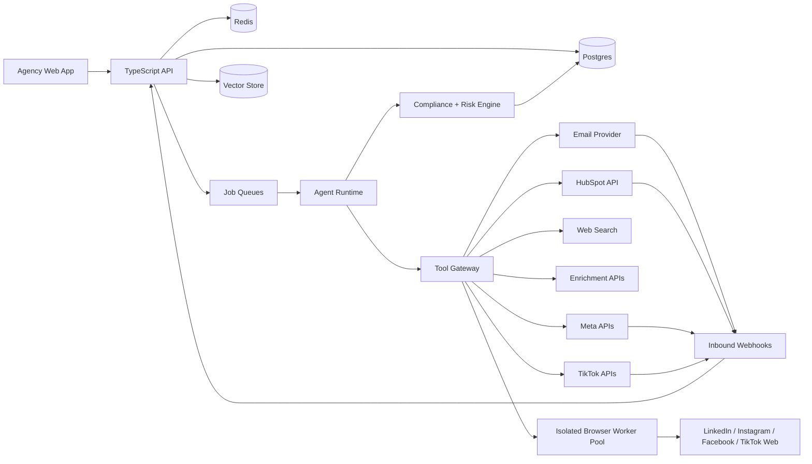

# AI Lead Agent Architecture

Last updated: 2026-05-11

## 1. Product Review

AI Lead Agent is an agency-focused platform for running lead generation and outbound campaigns for multiple clients. The product supports B2B and B2C workflows across email, HubSpot, LinkedIn, Instagram, Facebook, and TikTok.

The strongest product wedge is agency leverage: one operator can define an audience, connect client channels, let agents discover and qualify leads, generate personalized outreach, and report performance back to the client. The riskiest parts are consumer privacy, platform terms, deliverability, hallucinated personalization, cross-client data leakage, and account restrictions caused by browser automation.

The MVP should therefore separate lead generation into two lanes:

1. Consented or inbound lane: imports, CRM lists, ad lead forms, website forms, inbound DMs, comments, replies, and other sources where consent or user intent is known.
2. High-risk cold social lane: public profile discovery, browser automation, cold DMs, follows, comments, connection requests, and profile scraping. This lane requires explicit client risk acceptance, feature flags, strict rate limits, immutable audit logs, compliance checks, and kill switches.

The default product experience should guide agencies toward consented/inbound workflows and official APIs. Browser automation can exist as a high-risk module, but it must be isolated from the core system and easy to disable per client, campaign, channel, or account.

## 2. Goals And Non-Goals

### Goals

- Support agencies managing multiple client workspaces.
- Support B2B, B2C, and mixed campaigns.
- Discover, import, enrich, score, and dedupe leads.
- Generate source-backed outreach for email and social channels.
- Run email campaigns autonomously within configured compliance and deliverability limits.
- Support LinkedIn, Instagram, Facebook, and TikTok through official/inbound APIs where possible and isolated browser automation where explicitly enabled.
- Sync contacts, companies, deals, activities, and campaign outcomes with HubSpot.
- Maintain global-ready consent, lawful basis, jurisdiction, opt-out, source, and retention metadata.
- Provide auditable agent runs, tool calls, generated messages, sends, social actions, and compliance decisions.

### Non-Goals For MVP

- No CAPTCHA bypassing, access-control circumvention, fake identity generation, or anti-detection tooling.
- No autonomous targeting of minors or sensitive categories.
- No SMS, phone, WhatsApp, or push notification outreach in the first release.
- No Salesforce-first implementation. HubSpot is the first CRM integration.
- No unsupervised data sharing across agency clients.
- No guarantee that browser automation complies with LinkedIn, Meta, TikTok, or other platform terms.

## 3. System Overview



The core platform is a multi-tenant SaaS app. The web app and API handle agency workspaces, client configuration, campaigns, reviews, analytics, and admin controls. Background workers run agent jobs. A tool gateway mediates every external action so the platform can enforce permissions, log evidence, rate limit usage, and stop unsafe behavior before it reaches an external provider.

Browser automation is not part of the main API process. It runs in a separate worker pool with separate credentials, network policy, observability, and kill switches. The platform treats browser automation as high-risk for LinkedIn, Meta, and TikTok unless a platform explicitly permits the action through an official API or written approval.

## 4. Reference Stack

- Frontend: Next.js with TypeScript.
- API: Node.js TypeScript service using REST or tRPC-style routers.
- Agent runtime: TypeScript orchestration layer with queue-backed deterministic workflows.
- Database: Postgres with row-level tenant checks in application code and optional Postgres RLS.
- Cache and queue state: Redis.
- Background jobs: BullMQ for MVP, Temporal if workflows become long-running and complex.
- Vector memory: pgvector for MVP, with a later option to move to a managed vector database.
- Object storage: S3-compatible storage for exports, attachments, browser artifacts, and audit bundles.
- Browser automation: Playwright workers in isolated containers.
- Secrets: managed secrets vault such as AWS Secrets Manager, GCP Secret Manager, Doppler, or Vault.
- Observability: OpenTelemetry traces, structured logs, metrics, alerting, and error reporting.
- Deployment: containerized services on AWS ECS/Fargate, Fly.io, Render, or Kubernetes when scale requires it.

## 5. Tenancy And Roles

The top-level tenant is the agency. Each agency owns multiple client workspaces. All client-specific data must be scoped by both `agency_id` and `client_id`.

Roles:

- Agency owner: manages billing, users, client workspaces, global integrations, and risk policies.
- Agency admin: manages users, clients, campaigns, and integrations.
- Campaign manager: creates audiences, campaigns, approvals, and reports for assigned clients.
- Reviewer: approves leads, messages, and high-risk actions.
- Analyst: reads reports and exports.
- Client viewer: limited access to their own workspace reporting and approved campaign artifacts.
- System admin: internal operator role with break-glass access, approval logging, and strict monitoring.

Permission model:

- Every API request resolves `agency_id`, allowed `client_ids`, role, and permission claims.
- No business query may run without tenant filters.
- Service-to-service calls use short-lived credentials and scoped permissions.
- Break-glass access requires justification and writes immutable audit logs.

## 6. Core Agents

Agents are specialized workers that operate through the tool gateway. They do not receive raw database credentials. They receive scoped task payloads, retrieve allowed context, call approved tools, and write structured outputs.

### 6.1 Audience Strategy Agent

Purpose: convert a client brief into a usable B2B ICP, B2C audience segment, or mixed campaign target.

Inputs:

- Client profile, offer, geography, language, excluded audiences, compliance requirements, budget, and channels.
- Prior campaign outcomes and approved brand voice.

Outputs:

- B2B ICPs: industry, company size, revenue, geography, tech stack, trigger events, buyer personas, exclusions.
- B2C audience segments: interests, demographics allowed by law/platform policy, geographies, behaviors, inbound triggers, exclusions.
- Scoring rules, source requirements, consent requirements, and disqualification rules.

Rules:

- B2C audiences must not target minors, protected classes, health status, financial distress, political persuasion, or other sensitive categories unless a reviewed legal basis and platform policy allow it.
- Every segment must include jurisdictions and a default consent/lawful-basis policy.

### 6.2 Lead Discovery Agent

Purpose: discover or import leads and label them by source, channel eligibility, and risk lane.

Inputs:

- ICP/audience segment, allowed sources, jurisdiction policy, campaign channel policy.

Tools:

- Web search, company website crawler, approved enrichment provider, CSV import parser, HubSpot import, Meta lead forms, TikTok official APIs where approved, social inbound events, and high-risk social discovery where enabled.

Outputs:

- Candidate companies, contacts, consumer profiles, social identities, source URLs, source type, jurisdiction guess, and risk lane.

Rules:

- All leads need a source record and acquisition timestamp.
- Cold B2C leads from public social sources go to the high-risk lane and cannot be messaged until the Compliance & Safety Agent approves the action.
- Imported leads require the importer to declare source, consent status, privacy notice status, and jurisdiction assumptions.

### 6.3 Research & Context Agent

Purpose: gather source-backed context for qualification and personalization.

Inputs:

- Lead account, contact, consumer profile, social identity, campaign goal.

Tools:

- Web search, company site crawler, official profile APIs where available, enrichment provider, public page/post/comment readers where allowed, HubSpot history, prior conversation memory.

Outputs:

- Research facts with citations, timestamps, confidence, and sensitivity labels.
- Personalization angles.
- Disqualifying evidence.

Rules:

- Personalization claims must link to a stored `research_facts` record.
- Sensitive or inferred B2C traits are blocked from outreach copy unless explicitly permitted by policy.
- Prompt-injection text from pages, posts, bios, or comments is treated as untrusted content.

### 6.4 Qualification Agent

Purpose: decide whether a candidate should be pursued and through which channels.

Inputs:

- ICP/audience rules, research facts, consent records, jurisdiction rules, suppression lists, prior outcomes.

Outputs:

- Fit score, intent score, risk score, channel eligibility, rejection reason, review requirement.

Rules:

- Suppressed, opted-out, bounced, complained, or deleted contacts are blocked globally for the relevant client and channel.
- B2C profiles without consent or allowed legal basis are not eligible for direct electronic marketing in strict jurisdictions.
- A lead can be eligible for reporting or ad audience analysis while still being ineligible for outbound messaging.

### 6.5 Content & Outreach Agent

Purpose: generate messages that match brand voice, channel constraints, evidence, and compliance rules.

Inputs:

- Campaign goal, lead profile, research facts, brand voice, approved examples, channel policy, compliance policy.

Outputs:

- Email subject/body, LinkedIn DM, Instagram DM/comment reply, Facebook DM/comment reply, TikTok comment/creator message where allowed, follow-up variants, and fallback human-review notes.

Rules:

- No unsupported claims, fake familiarity, deceptive urgency, fake scarcity, or invented facts.
- Every commercial email must include required footer metadata and unsubscribe handling.
- B2C copy must avoid sensitive-trait references and avoid implying surveillance.
- Messages include a machine-readable `claims` array tied to research facts.

### 6.6 Channel Orchestrator Agent

Purpose: choose what happens next and route actions to the right channel or review queue.

Inputs:

- Channel eligibility, autonomy policy, rate limits, account health, campaign sequence, compliance decision.

Outputs:

- Send job, social action job, CRM sync job, human-review task, pause decision, or campaign-stop decision.

Rules:

- High-risk actions require `risk_acceptance_id`.
- If official/inbound mode is available, prefer it over browser automation.
- If account health degrades, pause the account and notify the campaign manager.
- If complaint, opt-out, or legal deletion request arrives, stop pending actions for that identity.

### 6.7 Social Automation Agent

Purpose: execute approved browser-based actions for LinkedIn, Instagram, Facebook, and TikTok when explicitly enabled.

Inputs:

- Approved action job, social account, campaign limits, account health, browser session reference.

Allowed action types:

- View profile/page.
- Collect limited metadata already approved by policy.
- Draft or submit messages/comments/follows only when the campaign policy allows it.
- Capture evidence screenshots for audit.

Hard constraints:

- No CAPTCHA solving.
- No bypassing paywalls, login barriers, access controls, blocks, use limits, or security challenges.
- No fake accounts generated by the system.
- No hidden anti-detection or fingerprint evasion logic.
- No scraping beyond the approved action schema.
- Pause immediately on challenge, warning, block, unusual login prompt, or account restriction.

Outputs:

- `social_actions` records, screenshots/artifacts when useful, account health events, failure reasons, and audit logs.

### 6.8 Compliance & Safety Agent

Purpose: block unsafe or non-compliant actions before they execute.

Inputs:

- Lead identity, source, jurisdiction, lawful basis/consent, channel, generated message, campaign settings, platform policy, risk acceptance.

Outputs:

- `approved`, `needs_review`, `blocked`, or `paused`.
- Human-readable reason and machine-readable policy codes.

Policy checks:

- Consent/lawful basis exists for the action and jurisdiction.
- Opt-out and suppression lists are clean.
- Message includes required unsubscribe/identity/address fields where needed.
- Claims are source-backed.
- B2C targeting does not use disallowed sensitive categories.
- Platform action is allowed by official API or marked high-risk with explicit acceptance.
- Send volume, frequency, and account health are within configured bounds.

### 6.9 CRM & Reporting Agent

Purpose: keep HubSpot and internal reporting aligned.

Inputs:

- Leads, companies, contacts, messages, replies, conversions, campaign metrics, HubSpot mappings.

Outputs:

- HubSpot companies, contacts, deals, notes, tasks, timeline events, campaign reports, client dashboards, and export files.

Rules:

- HubSpot field mappings are client-specific.
- CRM sync never resurrects an opted-out or deleted identity.
- Conflicts are logged and routed to review when destructive updates would occur.

## 7. Tool Gateway

All tools are registered in a central gateway. Agents call tools by name with typed schemas. The gateway enforces permissions, validates inputs, records outputs, rate limits calls, redacts secrets, and logs tool evidence.

Core tools:

- `web.search`: search the public web for company, contact, profile, and intent evidence.
- `web.fetch`: fetch approved pages and extract text with source URL and timestamp.
- `company.crawl`: crawl a company site within domain and robots/policy constraints.
- `enrichment.lookup_company`: enrich company attributes.
- `enrichment.lookup_contact`: enrich contact attributes and emails.
- `email.verify`: verify deliverability risk for an email address.
- `email.send`: send email through a connected inbox/provider.
- `email.parse_reply`: classify replies, objections, auto-replies, bounces, and opt-outs.
- `hubspot.sync`: create/update/read HubSpot objects.
- `meta.lead_forms`: ingest Facebook/Instagram lead form submissions where official access exists.
- `meta.messaging`: handle supported inbound/reply workflows where official access exists.
- `tiktok.content`: publish or manage content through approved TikTok APIs where available.
- `tiktok.inbound`: ingest supported official webhooks/events.
- `browser.social_action`: enqueue an approved high-risk browser action.
- `consent.check`: evaluate consent, lawful basis, opt-out, and jurisdiction policy.
- `moderation.check`: detect unsafe, deceptive, sensitive, or prohibited message content.
- `policy.evaluate`: run platform, campaign, and legal policy checks.
- `audit.write`: append immutable audit events.
- `vector.search`: retrieve scoped memory.
- `vector.upsert`: store scoped research or playbook memory.

Tool result format:

```json
{
  "tool_call_id": "tc_123",
  "status": "success",
  "source": "provider_or_url",
  "confidence": 0.87,
  "data": {},
  "evidence": [
    {
      "type": "url",
      "value": "https://example.com/source",
      "retrieved_at": "2026-05-11T00:00:00Z"
    }
  ],
  "policy_flags": []
}
```

## 8. Memory Architecture

### Short-Term Memory

Stored in Redis and queue payloads.

- Current agent step.
- Retry count.
- Rate-limit state.
- Browser session lock.
- Temporary research bundle.
- Pending compliance decision.

Retention: hours to days, depending on job type.

### Durable Operational Memory

Stored in Postgres.

- Agencies, clients, users, roles, campaigns, leads, identities, consent, messages, actions, replies, CRM mappings, and audit logs.
- Every durable record that contains client data includes `agency_id` and `client_id`.
- Every contact/profile record includes jurisdiction, source, consent/lawful basis, opt-out state, and retention metadata.

Retention: client-configured, jurisdiction-aware, and deletable through privacy workflows.

### Semantic Long-Term Memory

Stored in pgvector or a managed vector store.

Uses:

- Client brand voice.
- Approved campaign examples.
- Research facts.
- Objection handling.
- Replies and outcome learnings.
- Client-specific compliance notes.

Rules:

- Vector records are scoped by `agency_id`, `client_id`, and optional `campaign_id`.
- No cross-client retrieval by default.
- B2C personal data in vector memory must support deletion by profile/contact ID.
- Sensitive facts are either excluded from vector memory or stored with strict policy labels.

Memory record shape:

```json
{
  "memory_id": "mem_123",
  "agency_id": "ag_123",
  "client_id": "cl_123",
  "campaign_id": "cmp_123",
  "subject_type": "research_fact",
  "subject_id": "fact_123",
  "text": "Approved source-backed fact or campaign note.",
  "embedding": "[vector]",
  "sensitivity": "normal",
  "retention_expires_at": "2027-05-11T00:00:00Z"
}
```

## 9. Database Structure

Use UUID or ULID primary keys. All business tables include:

- `id`
- `agency_id`
- `client_id` where client-scoped
- `created_at`
- `updated_at`
- `created_by`
- `deleted_at` where soft delete is needed

### 9.1 Tenancy And Identity

#### `agencies`

- `id`
- `name`
- `billing_plan`
- `default_region`
- `status`

#### `clients`

- `id`
- `agency_id`
- `name`
- `industry`
- `website_url`
- `default_jurisdictions`
- `risk_profile`
- `status`

#### `users`

- `id`
- `agency_id`
- `email`
- `name`
- `status`
- `last_login_at`
- `mfa_enabled`

#### `roles`

- `id`
- `agency_id`
- `name`
- `scope`

#### `permissions`

- `id`
- `role_id`
- `resource`
- `action`
- `conditions`

#### `user_client_access`

- `id`
- `agency_id`
- `user_id`
- `client_id`
- `role_id`

#### `client_settings`

- `id`
- `agency_id`
- `client_id`
- `brand_voice`
- `risk_defaults`
- `jurisdiction_defaults`
- `retention_policy`
- `reporting_timezone`

### 9.2 Campaigns

#### `campaigns`

- `id`
- `agency_id`
- `client_id`
- `name`
- `campaign_type`: `b2b`, `b2c`, `mixed`
- `goal`
- `offer`
- `status`: `draft`, `review`, `active`, `paused`, `completed`, `archived`
- `default_jurisdictions`
- `autonomy_level`: `review_required`, `guardrailed_auto`, `fully_autonomous`
- `budget_limit`
- `daily_action_limit`
- `starts_at`
- `ends_at`

#### `audience_segments`

- `id`
- `agency_id`
- `client_id`
- `campaign_id`
- `name`
- `segment_type`: `b2b_icp`, `b2c_audience`, `mixed`
- `description`
- `geographies`
- `allowed_attributes`
- `excluded_attributes`
- `consent_requirements`
- `sensitive_category_policy`

#### `icps`

- `id`
- `agency_id`
- `client_id`
- `campaign_id`
- `industries`
- `company_sizes`
- `revenue_ranges`
- `technologies`
- `buyer_personas`
- `trigger_events`
- `exclusions`
- `scoring_rules`

#### `channel_policies`

- `id`
- `agency_id`
- `client_id`
- `campaign_id`
- `channel`: `email`, `linkedin`, `instagram`, `facebook`, `tiktok`, `hubspot`
- `mode`: `official_api`, `inbound_only`, `assisted_task`, `browser_automation`
- `risk_level`: `low`, `medium`, `high`, `blocked`
- `daily_limit`
- `hourly_limit`
- `cooldown_minutes`
- `requires_review`
- `requires_risk_acceptance`
- `enabled`

#### `autonomy_policies`

- `id`
- `agency_id`
- `client_id`
- `campaign_id`
- `can_discover_leads`
- `can_generate_messages`
- `can_send_email`
- `can_execute_social_actions`
- `max_daily_sends`
- `max_daily_social_actions`
- `required_confidence`
- `blocked_jurisdictions`
- `human_review_triggers`

#### `campaign_sequences`

- `id`
- `agency_id`
- `client_id`
- `campaign_id`
- `name`
- `steps`
- `stop_conditions`
- `reply_handling_rules`
- `timezone`

### 9.3 Leads And Identity Graph

#### `lead_accounts`

- `id`
- `agency_id`
- `client_id`
- `campaign_id`
- `name`
- `domain`
- `industry`
- `company_size`
- `country`
- `source_type`
- `source_url`
- `fit_score`
- `status`

#### `contacts`

- `id`
- `agency_id`
- `client_id`
- `lead_account_id`
- `email`
- `first_name`
- `last_name`
- `title`
- `company_name`
- `country`
- `jurisdiction`
- `source_type`
- `source_url`
- `consent_status`
- `lawful_basis_id`
- `opt_out_status`
- `retention_expires_at`
- `status`

#### `consumer_profiles`

- `id`
- `agency_id`
- `client_id`
- `campaign_id`
- `display_name`
- `email`
- `phone_hash`
- `country`
- `region`
- `jurisdiction`
- `age_band`
- `source_type`
- `source_url`
- `consent_status`
- `lawful_basis_id`
- `opt_out_status`
- `sensitive_category_flags`
- `retention_expires_at`
- `status`

#### `social_identities`

- `id`
- `agency_id`
- `client_id`
- `platform`: `linkedin`, `instagram`, `facebook`, `tiktok`
- `platform_user_id`
- `handle`
- `profile_url`
- `identity_type`: `contact`, `consumer_profile`, `creator`, `company_page`
- `source_type`
- `source_url`
- `risk_lane`: `consented_inbound`, `high_risk_cold_social`
- `status`

#### `identity_links`

- `id`
- `agency_id`
- `client_id`
- `contact_id`
- `consumer_profile_id`
- `social_identity_id`
- `confidence`
- `evidence`
- `created_by_agent_run_id`

#### `lead_scores`

- `id`
- `agency_id`
- `client_id`
- `campaign_id`
- `lead_account_id`
- `contact_id`
- `consumer_profile_id`
- `fit_score`
- `intent_score`
- `risk_score`
- `explanation`
- `scored_by_agent_run_id`

#### `research_facts`

- `id`
- `agency_id`
- `client_id`
- `campaign_id`
- `subject_type`
- `subject_id`
- `fact_text`
- `source_url`
- `source_title`
- `retrieved_at`
- `confidence`
- `sensitivity`
- `allowed_for_personalization`

### 9.4 Consent And Compliance

#### `consent_events`

- `id`
- `agency_id`
- `client_id`
- `subject_type`
- `subject_id`
- `channel`
- `event_type`: `consent_granted`, `consent_withdrawn`, `soft_opt_in`, `inbound_request`, `import_declared`, `unknown`
- `source`
- `source_url`
- `jurisdiction`
- `privacy_notice_version`
- `occurred_at`
- `evidence`

#### `lawful_basis_records`

- `id`
- `agency_id`
- `client_id`
- `subject_type`
- `subject_id`
- `purpose`
- `lawful_basis`: `consent`, `legitimate_interest`, `contract`, `legal_obligation`, `not_applicable`, `unknown`
- `jurisdiction`
- `assessment`
- `expires_at`
- `approved_by`

#### `jurisdiction_rules`

- `id`
- `jurisdiction`
- `channel`
- `audience_type`: `b2b`, `b2c`, `mixed`
- `requires_consent`
- `allows_legitimate_interest`
- `requires_unsubscribe`
- `requires_physical_address`
- `requires_privacy_notice`
- `retention_days`
- `blocked_sensitive_categories`
- `notes`

#### `suppression_lists`

- `id`
- `agency_id`
- `client_id`
- `scope`: `client`, `agency`, `global`
- `channel`
- `identifier_type`: `email`, `domain`, `phone_hash`, `social_handle`, `platform_user_id`
- `identifier_hash`
- `reason`
- `source`
- `created_at`

#### `privacy_requests`

- `id`
- `agency_id`
- `client_id`
- `request_type`: `access`, `delete`, `export`, `correct`, `object`, `withdraw_consent`
- `subject_identifier_hash`
- `jurisdiction`
- `status`
- `received_at`
- `due_at`
- `completed_at`
- `evidence`

#### `opt_outs`

- `id`
- `agency_id`
- `client_id`
- `subject_type`
- `subject_id`
- `channel`
- `reason`
- `source`
- `occurred_at`

#### `risk_acceptances`

- `id`
- `agency_id`
- `client_id`
- `campaign_id`
- `risk_type`: `browser_automation`, `cold_b2c_social`, `platform_tos`, `jurisdictional_uncertainty`
- `accepted_by`
- `accepted_at`
- `expires_at`
- `terms_snapshot`
- `notes`

### 9.5 Messaging And Actions

#### `message_templates`

- `id`
- `agency_id`
- `client_id`
- `campaign_id`
- `channel`
- `name`
- `template_body`
- `required_variables`
- `approved_by`
- `status`

#### `generated_messages`

- `id`
- `agency_id`
- `client_id`
- `campaign_id`
- `subject_type`
- `subject_id`
- `channel`
- `subject_line`
- `body`
- `claims`
- `research_fact_ids`
- `compliance_status`
- `status`
- `generated_by_agent_run_id`

#### `sends`

- `id`
- `agency_id`
- `client_id`
- `campaign_id`
- `generated_message_id`
- `connected_inbox_id`
- `recipient_contact_id`
- `scheduled_at`
- `sent_at`
- `provider_message_id`
- `status`
- `bounce_status`
- `complaint_status`

#### `social_actions`

- `id`
- `agency_id`
- `client_id`
- `campaign_id`
- `social_account_id`
- `social_identity_id`
- `platform`
- `action_type`
- `mode`: `official_api`, `assisted_task`, `browser_automation`
- `payload`
- `risk_acceptance_id`
- `scheduled_at`
- `executed_at`
- `status`
- `failure_reason`
- `account_health_snapshot`

#### `conversation_threads`

- `id`
- `agency_id`
- `client_id`
- `campaign_id`
- `channel`
- `subject_type`
- `subject_id`
- `external_thread_id`
- `status`

#### `replies`

- `id`
- `agency_id`
- `client_id`
- `conversation_thread_id`
- `channel`
- `body`
- `classification`: `positive`, `negative`, `question`, `objection`, `opt_out`, `auto_reply`, `bounce`, `complaint`, `unknown`
- `received_at`
- `parsed_by_agent_run_id`

#### `bounces`

- `id`
- `agency_id`
- `client_id`
- `send_id`
- `bounce_type`
- `provider_payload`
- `received_at`

#### `complaints`

- `id`
- `agency_id`
- `client_id`
- `send_id`
- `channel`
- `provider_payload`
- `received_at`

### 9.6 Integrations

#### `connected_inboxes`

- `id`
- `agency_id`
- `client_id`
- `provider`
- `email`
- `sending_domain`
- `status`
- `daily_limit`
- `warmup_status`
- `secret_ref`

#### `social_accounts`

- `id`
- `agency_id`
- `client_id`
- `platform`
- `handle`
- `connection_mode`: `official_api`, `browser_session`, `manual_task`
- `status`
- `account_health`
- `daily_limit`
- `secret_ref`
- `last_checked_at`

#### `hubspot_mappings`

- `id`
- `agency_id`
- `client_id`
- `hubspot_portal_id`
- `object_type`
- `local_field`
- `hubspot_field`
- `sync_direction`
- `conflict_policy`

#### `webhooks`

- `id`
- `agency_id`
- `client_id`
- `provider`
- `event_type`
- `external_event_id`
- `signature_valid`
- `received_at`
- `processed_at`
- `status`
- `payload_ref`

#### `provider_credentials`

- `id`
- `agency_id`
- `client_id`
- `provider`
- `scope`
- `secret_ref`
- `status`
- `expires_at`
- `rotated_at`

### 9.7 Observability And Audit

#### `agent_runs`

- `id`
- `agency_id`
- `client_id`
- `campaign_id`
- `agent_type`
- `input_ref`
- `output_ref`
- `status`
- `started_at`
- `completed_at`
- `model`
- `cost_usd`
- `error_code`

#### `tool_calls`

- `id`
- `agency_id`
- `client_id`
- `agent_run_id`
- `tool_name`
- `input_ref`
- `output_ref`
- `status`
- `started_at`
- `completed_at`
- `cost_usd`

#### `audit_logs`

- `id`
- `agency_id`
- `client_id`
- `actor_type`: `user`, `agent`, `system`
- `actor_id`
- `event_type`
- `resource_type`
- `resource_id`
- `before_ref`
- `after_ref`
- `ip_address`
- `user_agent`
- `created_at`

#### `cost_events`

- `id`
- `agency_id`
- `client_id`
- `campaign_id`
- `provider`
- `event_type`
- `quantity`
- `cost_usd`
- `created_at`

#### `rate_limit_events`

- `id`
- `agency_id`
- `client_id`
- `resource_type`
- `resource_id`
- `channel`
- `limit_type`
- `current_count`
- `limit_value`
- `action_taken`
- `created_at`

#### `policy_violations`

- `id`
- `agency_id`
- `client_id`
- `campaign_id`
- `policy_code`
- `severity`
- `resource_type`
- `resource_id`
- `decision`
- `explanation`
- `created_at`

## 10. API Design

Use JSON APIs with typed request/response schemas. Internal agent APIs should be separate from public/user APIs.

### 10.1 Auth And Tenancy

- `POST /api/auth/login`
- `POST /api/auth/logout`
- `POST /api/auth/mfa/verify`
- `GET /api/me`
- `GET /api/agencies/:agencyId/clients`
- `POST /api/agencies/:agencyId/clients`
- `PATCH /api/clients/:clientId/settings`
- `GET /api/clients/:clientId/audit-logs`

### 10.2 Campaigns And Audiences

- `POST /api/clients/:clientId/campaigns`
- `GET /api/clients/:clientId/campaigns`
- `GET /api/campaigns/:campaignId`
- `PATCH /api/campaigns/:campaignId`
- `POST /api/campaigns/:campaignId/audience-strategy`
- `POST /api/campaigns/:campaignId/icps`
- `POST /api/campaigns/:campaignId/audience-segments`
- `POST /api/campaigns/:campaignId/channel-policies`
- `POST /api/campaigns/:campaignId/autonomy-policy`
- `POST /api/campaigns/:campaignId/launch`
- `POST /api/campaigns/:campaignId/pause`
- `POST /api/campaigns/:campaignId/stop`

### 10.3 Leads And Research

- `POST /api/campaigns/:campaignId/leads/discover`
- `POST /api/campaigns/:campaignId/leads/import`
- `GET /api/campaigns/:campaignId/leads`
- `GET /api/leads/:leadId`
- `POST /api/leads/:leadId/research`
- `POST /api/leads/:leadId/score`
- `POST /api/leads/:leadId/suppress`
- `GET /api/leads/:leadId/research-facts`

### 10.4 Consent, Risk, And Compliance

- `POST /api/clients/:clientId/consent-events`
- `GET /api/clients/:clientId/suppression-lists`
- `POST /api/clients/:clientId/suppression-lists`
- `POST /api/clients/:clientId/privacy-requests`
- `GET /api/clients/:clientId/privacy-requests`
- `POST /api/campaigns/:campaignId/risk-acceptances`
- `GET /api/campaigns/:campaignId/policy-violations`
- `POST /api/compliance/evaluate-message`
- `POST /api/compliance/evaluate-action`

### 10.5 Messaging And Social Actions

- `POST /api/campaigns/:campaignId/messages/generate`
- `GET /api/campaigns/:campaignId/messages`
- `POST /api/messages/:messageId/approve`
- `POST /api/messages/:messageId/reject`
- `POST /api/messages/:messageId/send`
- `POST /api/social-actions`
- `GET /api/social-actions/:socialActionId`
- `POST /api/social-actions/:socialActionId/cancel`
- `GET /api/conversations`
- `GET /api/conversations/:threadId`
- `POST /api/conversations/:threadId/reply`

### 10.6 Integrations

- `POST /api/clients/:clientId/inboxes/connect`
- `GET /api/clients/:clientId/inboxes`
- `POST /api/clients/:clientId/social-accounts/connect`
- `GET /api/clients/:clientId/social-accounts`
- `POST /api/clients/:clientId/hubspot/connect`
- `GET /api/clients/:clientId/hubspot/mappings`
- `PATCH /api/clients/:clientId/hubspot/mappings`
- `POST /api/clients/:clientId/hubspot/sync`

### 10.7 Analytics

- `GET /api/campaigns/:campaignId/analytics`
- `GET /api/clients/:clientId/analytics`
- `GET /api/campaigns/:campaignId/costs`
- `GET /api/campaigns/:campaignId/risk-report`
- `POST /api/campaigns/:campaignId/export`

### 10.8 Webhooks

- `POST /api/webhooks/email/:provider`
- `POST /api/webhooks/hubspot`
- `POST /api/webhooks/meta`
- `POST /api/webhooks/tiktok`
- `POST /api/webhooks/browser-worker`
- `POST /api/webhooks/compliance`

Webhook requirements:

- Verify signatures where providers support them.
- Enforce idempotency by `external_event_id`.
- Store raw payloads in object storage with a database reference.
- Never trust webhook payloads for tenant routing without validating integration ownership.

## 11. User Journeys

### 11.1 Agency Onboarding

1. Agency owner creates an account.
2. Owner enables MFA and invites team members.
3. Owner configures billing, default region, and default risk posture.
4. Platform creates default roles and permission templates.
5. Agency creates first client workspace.

Success criteria:

- Users can only see assigned clients.
- Every admin action is audited.
- No outbound action is possible before a client workspace exists.

### 11.2 Client Workspace Setup

1. Campaign manager enters client name, website, industry, target regions, and brand voice.
2. Manager connects HubSpot.
3. Manager connects inboxes and verifies sending domains.
4. Manager connects social accounts in official API mode where available.
5. Manager may connect browser-session accounts only after reading and accepting high-risk terms.
6. Platform creates default channel policies and jurisdiction rules.

Success criteria:

- HubSpot and inbox health are visible.
- Social accounts show connection mode and risk level.
- Browser automation is disabled until a `risk_acceptance` exists.

### 11.3 B2B Campaign Creation

1. User chooses `B2B`.
2. Audience Strategy Agent generates ICPs from the client brief.
3. User reviews industries, buyer personas, exclusions, geographies, and scoring rules.
4. User selects email, LinkedIn, HubSpot, and optional social channels.
5. Compliance & Safety Agent identifies required policy settings.
6. User launches discovery.

Success criteria:

- Leads have company/contact structure.
- B2B direct marketing rules are applied by jurisdiction.
- LinkedIn browser actions are high-risk unless official/assisted mode is selected.

### 11.4 B2C Campaign Creation

1. User chooses `B2C`.
2. Audience Strategy Agent creates audience segments and exclusions.
3. User selects source lane: consented/inbound, high-risk cold social, or both separated.
4. User declares consent source and target jurisdictions.
5. Platform blocks sensitive categories and minor-targeting by default.
6. User connects lead forms, website forms, inbound social, imports, or high-risk discovery.

Success criteria:

- Every consumer profile has consent/lawful-basis metadata.
- High-risk cold social profiles are separated from consented leads.
- Unsupported jurisdictions or channels block outbound actions.

### 11.5 Autonomous Lead Discovery

1. Lead Discovery Agent gathers candidates from allowed sources.
2. Research & Context Agent collects facts and citations.
3. Qualification Agent scores and dedupes identities.
4. Compliance & Safety Agent labels channel eligibility.
5. Leads are stored as approved, needs-review, blocked, or suppressed.

Success criteria:

- Every lead has source metadata.
- No suppressed identity becomes eligible.
- Agents explain why a lead qualifies or is blocked.

### 11.6 Message Generation And QA

1. Content & Outreach Agent generates channel-specific messages.
2. Compliance & Safety Agent validates claims, footer requirements, opt-out language, and sensitive content.
3. Channel Orchestrator decides send, social action, or review.
4. Human review is required for policy triggers.

Success criteria:

- Every claim maps to research facts.
- Email includes required identity and unsubscribe fields.
- B2C messages do not reference sensitive inferred traits.

### 11.7 Email Sending

1. Orchestrator selects inbox and sequence step.
2. Email provider sends message within daily/hourly limits.
3. Webhooks capture delivered, bounced, complained, opened/clicked where allowed, replied, and unsubscribed events.
4. Replies are classified and synced to HubSpot.
5. Opt-outs update suppression lists and cancel pending steps.

Success criteria:

- Opt-out is honored across all pending campaign steps.
- Bounces and complaints lower sender health.
- HubSpot receives timeline events.

### 11.8 Social Official/Inbound Flow

1. Meta/TikTok/LinkedIn official integrations ingest lead forms, comments, DMs, or allowed events.
2. Agents classify intent and generate replies within platform-supported windows.
3. Compliance checks run before any reply.
4. Orchestrator sends through official APIs or routes to human task.

Success criteria:

- Official APIs are preferred over browser automation.
- Inbound conversations preserve context and consent state.
- Unsupported actions become manual tasks, not hidden automation.

### 11.9 High-Risk Browser Automation Flow

1. User enables browser automation for a client, channel, campaign, and account.
2. User accepts risk terms and account-specific limits.
3. Compliance & Safety Agent approves each action job.
4. Browser worker executes the approved action only.
5. Worker records result, screenshots where useful, and account health.
6. Warnings, challenges, blocks, or unusual prompts pause the account.

Success criteria:

- All actions have a `risk_acceptance_id`.
- Workers cannot execute actions that are not in the approved schema.
- Kill switches can stop all browser automation globally, by client, by platform, or by account.

### 11.10 Reporting

1. CRM & Reporting Agent aggregates discovery, qualification, send, reply, conversion, cost, and risk metrics.
2. Client dashboard shows performance by campaign, source, channel, audience, and jurisdiction.
3. Agency dashboard shows client-level health, costs, account restrictions, compliance issues, and ROI.
4. Reports export to CSV/PDF and sync highlights to HubSpot.

Success criteria:

- Reports separate consented/inbound and high-risk social results.
- Costs and agent usage are visible.
- Risk events are visible to agency owners.

## 12. Compliance And Security Architecture

This product handles personal data and automated marketing. It needs compliance controls from day one.

### 12.1 Compliance Baselines

United States email:

- Follow FTC CAN-SPAM guidance for commercial email, including truthful headers, non-deceptive subject lines, clear identification, a valid physical postal address, opt-out mechanisms, prompt honoring of opt-outs, and monitoring vendors acting on the sender's behalf.

UK/EU marketing:

- Store lawful basis and consent records where required.
- Apply a legitimate-interest assessment only where electronic marketing rules allow it.
- Keep privacy notice evidence and source metadata.
- Provide objection, withdrawal, access, export, correction, and deletion workflows.

B2B:

- Corporate B2B email may be treated differently from consumer/sole-trader contexts in some jurisdictions, but the platform should still store opt-outs and screen new lists against suppression records.

B2C:

- Default to consented or inbound sources.
- Treat cold consumer social outreach as high-risk.
- Do not target minors or sensitive categories.
- Keep retention limits by jurisdiction.

### 12.2 Platform Policy Risk

LinkedIn:

- LinkedIn states that it does not permit third-party software such as crawlers, bots, browser plug-ins, or extensions that scrape or automate activity on LinkedIn's website. Treat all LinkedIn browser automation as high-risk.

Meta:

- Meta's automated data collection terms and platform policies require permission and govern automated collection/use of Meta product data. Treat Instagram and Facebook scraping, cold DM automation, and automated public-profile collection as high-risk unless performed through an approved official API or permissioned integration.

TikTok:

- TikTok developer access requires app registration/review and authorized use of developer services. TikTok's developer terms restrict unauthorized commercial solicitation, spam, unlawful collection of personal data, and profile/database building from TikTok data. Treat TikTok browser automation and cold outreach as high-risk.

### 12.3 Security Controls

- Encrypt provider credentials, OAuth tokens, browser session cookies, and API keys using envelope encryption.
- Store secrets only by `secret_ref`; never place raw secrets in agent prompts, logs, or database text columns.
- Use RBAC for every API route.
- Enforce tenant and client filters in every query.
- Validate webhook signatures and provider ownership.
- Use idempotency keys for sends, social actions, and webhook handling.
- Maintain immutable audit logs for all high-impact actions.
- Apply tool allowlists per agent and per campaign.
- Treat web/social content as untrusted input and strip instructions before sending content to LLMs.
- Redact PII in logs by default.
- Use data retention jobs and deletion workflows for B2C personal data.
- Run backups, restore tests, vulnerability scans, dependency scans, and incident response drills.

### 12.4 Kill Switches

Required kill switches:

- Global browser automation disable.
- Per-platform disable.
- Per-agency disable.
- Per-client disable.
- Per-campaign disable.
- Per-social-account disable.
- Per-inbox sending pause.
- Per-jurisdiction outbound block.
- Per-source block.
- Per-agent tool disable.

Kill switch activation writes an audit log and cancels queued jobs in the affected scope.

## 13. Deployment Plan

### 13.1 Environments

Local:

- Docker Compose for Postgres, Redis, API, web app, worker, and browser worker.
- Seed data for one agency, one B2B client, one B2C client, and mocked integrations.

Staging:

- Production-like infrastructure.
- Sandbox HubSpot account.
- Test inbox provider.
- Meta/TikTok sandbox or app-review test mode where available.
- Browser automation disabled by default.

Production:

- Separate API, web, worker, browser-worker, and webhook services.
- Managed Postgres with backups and point-in-time recovery.
- Managed Redis.
- Secrets manager.
- Object storage.
- Observability and alerting.
- Network isolation for browser workers.

### 13.2 Services

- `web`: Next.js frontend.
- `api`: authenticated user and public webhook API.
- `agent-worker`: lead discovery, research, qualification, generation, compliance, and reporting jobs.
- `send-worker`: email scheduling, delivery, retry, and reply processing.
- `crm-worker`: HubSpot sync and conflict handling.
- `social-api-worker`: official Meta/TikTok/LinkedIn API workflows.
- `browser-worker`: isolated Playwright jobs for approved high-risk actions.
- `retention-worker`: privacy requests, data deletion, retention expiry, and export jobs.

### 13.3 CI/CD

Pipeline:

1. Install dependencies.
2. Typecheck.
3. Lint.
4. Unit tests.
5. Integration tests with service containers.
6. Build containers.
7. Run migration dry-run.
8. Deploy to staging.
9. Run smoke tests.
10. Manual approval for production.
11. Deploy production with rolling or blue/green strategy.
12. Run production smoke tests.

Migration policy:

- Backward-compatible migrations first.
- Expand-contract for destructive schema changes.
- Background backfills for large data changes.
- Migration rollback plan documented per release.

### 13.4 Monitoring

Metrics:

- Agent job success/failure.
- Tool latency and error rate.
- Cost per campaign/client.
- Email bounce and complaint rate.
- Opt-out rate.
- HubSpot sync lag.
- Queue depth.
- Browser-worker warning/challenge/block rate.
- Account health by platform.
- Policy violations by severity.
- Cross-tenant access denial count.

Alerts:

- Complaint rate above threshold.
- Bounce rate above threshold.
- Browser account warnings or restrictions.
- Webhook signature failures spike.
- Queue backlog exceeds SLA.
- Agent error rate spike.
- Cost budget exceeded.
- Secrets rotation failure.
- Backup failure.

## 14. Implementation Roadmap

### Phase 1: SaaS Foundation

Deliver:

- Next.js app shell.
- TypeScript API.
- Auth, MFA-ready user model, agency/client tenancy, RBAC.
- Postgres schema migrations.
- Redis and queue setup.
- Audit log foundation.
- Secrets references.
- Basic dashboard for agencies, clients, campaigns, and users.

Acceptance criteria:

- Agency users can only access assigned clients.
- Every create/update/delete action writes audit logs.
- Background worker can process a simple test job.

### Phase 2: Lead Model And Policy Engine

Deliver:

- B2B ICP and B2C audience segment models.
- Lead/contact/consumer/social identity schema.
- Consent events, lawful basis, opt-outs, suppression lists, jurisdiction rules.
- Dedupe and identity linking.
- Qualification scoring service.
- Import flow for CSV and HubSpot contacts.

Acceptance criteria:

- Leads are separated by B2B/B2C and consented/high-risk lanes.
- Suppression checks block sends/actions.
- Jurisdiction rules can block or route leads to review.

### Phase 3: Research, Memory, And Message Generation

Deliver:

- Web search/fetch tools.
- Research facts with citations.
- Vector memory with tenant/client scoping.
- Content & Outreach Agent.
- Compliance & Safety Agent first version.
- Message review UI.

Acceptance criteria:

- Generated messages reference stored facts.
- Unsafe claims are blocked.
- B2C sensitive-trait references are blocked.
- Cross-client memory retrieval tests pass.

### Phase 4: Email And HubSpot

Deliver:

- Connected inbox model.
- Email provider integration.
- Scheduler and send worker.
- Unsubscribe, bounce, complaint, reply handling.
- HubSpot OAuth, field mapping, contact/company/deal/activity sync.
- Email analytics dashboard.

Acceptance criteria:

- Opt-outs cancel future sends.
- Bounces suppress invalid addresses.
- HubSpot sync is idempotent.
- Campaign manager can launch an email campaign under configured limits.

### Phase 5: Official Social API Workflows

Deliver:

- Social account connection model.
- Meta lead form/inbound event ingestion where approved.
- TikTok app registration path and approved API integrations where available.
- Social conversation threads.
- Reply generation for supported inbound windows.
- Human task fallback for unsupported official actions.

Acceptance criteria:

- Official/inbound actions do not require browser automation.
- Webhooks are signature-validated and idempotent.
- Unsupported outbound social actions route to review/manual task.

### Phase 6: High-Risk Browser Automation

Deliver:

- Isolated Playwright browser-worker service.
- Social action job schema.
- Risk acceptance flow.
- Per-account rate limits and account-health telemetry.
- Kill switches.
- Screenshots/artifacts for audit.
- Automatic pausing on platform warnings, challenges, blocks, or unusual prompts.

Acceptance criteria:

- Browser worker refuses jobs without risk acceptance.
- Browser worker only executes allowlisted action schemas.
- Global/client/platform/account kill switches cancel queued jobs.
- Account warnings pause future jobs.

### Phase 7: Global-Ready Hardening

Deliver:

- Privacy request workflows: access, export, delete, correct, object, withdraw consent.
- Retention expiry jobs.
- Advanced jurisdiction policy admin.
- Cost controls.
- Security review.
- Penetration test.
- Backup restore drill.
- Incident response runbooks.
- Beta rollout controls.

Acceptance criteria:

- Deletion/export workflows include database, vector memory, object storage, and CRM sync behavior.
- Retention jobs remove expired B2C personal data.
- Security review findings are tracked and resolved before GA.

## 15. Test Plan

### Unit Tests

- ICP and audience validation.
- Lead scoring.
- Dedupe and identity linking.
- Jurisdiction rule evaluation.
- Consent and lawful-basis evaluation.
- Suppression matching.
- Message claim extraction.
- Sensitive-category blocking.
- Sequence stop conditions.
- HubSpot field mapping.

### Integration Tests

- CSV import to lead records.
- HubSpot sync create/update/conflict flows.
- Email send and webhook lifecycle.
- Reply classification and opt-out propagation.
- Vector memory scoping.
- Tool gateway permission enforcement.
- Queue retries and dead-letter handling.
- Browser action job approval and refusal cases.

### End-To-End Tests

- Agency onboarding to first client.
- B2B ICP to email campaign launch.
- B2C consented lead form to inbound follow-up.
- Mixed campaign with email plus social review tasks.
- Opt-out received and all pending actions canceled.
- HubSpot reply-to-deal update.
- High-risk browser automation enabled, action executed, warning pauses account.
- Client report export.

### Security Tests

- Cross-tenant read/write attempts.
- Broken object-level authorization attempts.
- Prompt injection from crawled pages and social bios.
- Webhook signature failures.
- Secret leakage in logs and agent prompts.
- Tool-call schema bypass attempts.
- Rate-limit bypass attempts.
- Privacy deletion across database, vector store, object storage, and CRM.

### Load Tests

- Lead discovery queue at expected agency volume.
- Email scheduling and throttling.
- HubSpot sync bursts.
- Browser-worker concurrency limits.
- Vector search under campaign review load.
- Webhook ingestion spikes.

## 16. MVP Build Order

Recommended first build sequence:

1. Multi-tenant SaaS foundation.
2. Campaign, ICP, audience, and lead data model.
3. Consent, suppression, jurisdiction, and policy engine.
4. Lead import and HubSpot sync.
5. Research and message generation with review.
6. Email sending with unsubscribe/reply/bounce handling.
7. Reporting.
8. Official social/inbound workflows.
9. Browser automation as a separately gated beta module.
10. Global-ready privacy and retention hardening.

This order gets a valuable agency product into users' hands before the riskiest social automation work dominates the build.

## 17. Key Open Decisions

The architecture assumes the following defaults unless changed:

- HubSpot is the first CRM.
- Email is the first fully autonomous outbound channel.
- Instagram, Facebook, TikTok, and LinkedIn browser automation are high-risk beta features.
- B2C defaults to consented or inbound lead sources.
- Global-ready compliance is required, but legal review is still needed before production in each market.
- The first implementation uses Postgres, Redis, BullMQ, pgvector, and Playwright.

## 18. Official References To Review Before Launch

- FTC, [CAN-SPAM Act: A Compliance Guide for Business](https://www.ftc.gov/business-guidance/resources/can-spam-act-compliance-guide-business)
- LinkedIn, [Prohibited software and extensions](https://www.linkedin.com/help/linkedin/answer/a1341387)
- Meta, [Automated Data Collection Terms](https://www.facebook.com/legal/automated_data_collection_terms)
- Meta, [Terms of Service](https://www.facebook.com/terms)
- TikTok, [Developer Terms of Service](https://www.tiktok.com/legal/page/global/tik-tok-developer-terms-of-service/en)
- TikTok for Developers, [Developer Guidelines](https://developers.tiktok.com/doc/our-guidelines-developer-guidelines)
- TikTok for Developers, [Register Your App](https://developers.tiktok.com/doc/getting-started-create-an-app)
- EDPB, [Guidelines 1/2024 on processing of personal data based on Article 6(1)(f) GDPR](https://www.edpb.europa.eu/our-work-tools/documents/public-consultations/2024/guidelines-12024-processing-personal-data-based_sk?page=1)
- ICO, [Business-to-business marketing](https://ico.org.uk/for-organisations/direct-marketing-and-privacy-and-electronic-communications/business-to-business-marketing/)
- ICO, [Plan direct marketing](https://ico.org.uk/for-organisations/direct-marketing-and-privacy-and-electronic-communications/direct-marketing-guidance/plan-direct-marketing/)

